# ZAI MCP Servers

## Overview

ZAI provides 4 MCP servers for common AI tasks: web search, web content fetching, GitHub repository reading, and vision analysis. Each server has specialized tools optimized for specific use cases.

## Quick Reference

### Web Search Prime (web-search-prime)
| Tool | Use For |
|------|---------|
| `webSearchPrime` | Search the web with filters for domain, recency, location |

### Web Reader (web-reader)
| Tool | Use For |
|------|---------|
| `webReader` | Fetch and convert web pages to markdown (handles GitHub, images, links) |

### ZRead (zread)
| Tool | Use For |
|------|---------|
| `get_repo_structure` | Get GitHub repo directory structure |
| `read_file` | Read full file contents from GitHub |
| `search_doc` | Search GitHub repo docs, issues, commits |

### ZAI MCP Server (zai-mcp-server) - Vision Tools
| Tool | Use For | Input |
|------|---------|-------|
| `ui_to_artifact` | Convert UI screenshots to code, prompts, specs | Screenshot URL |
| `extract_text_from_screenshot` | OCR from code, terminals, documents | Screenshot URL |
| `diagnose_error_screenshot` | Debug errors from screenshots | Error screenshot URL |
| `understand_technical_diagram` | Architecture, flowcharts, UML, ER diagrams | Diagram URL |
| `analyze_data_visualization` | Charts, graphs, dashboards | Chart/image URL |
| `ui_diff_check` | Compare two UIs for differences | Two screenshot URLs |
| `analyze_image` | General image analysis (fallback) | Image URL |
| `analyze_video` | Video content analysis | Video URL |

## Tool Selection Guide

```dot
digraph tool_selection {
    "Visual content to analyze?" [shape=diamond, style=rounded];
    "UI/interface?" [shape=diamond];
    "Text extraction?" [shape=diamond];
    "Error message?" [shape=diamond];
    "Diagram?" [shape=diamond];
    "Chart/data?" [shape=diamond];
    "Two UIs to compare?" [shape=diamond];
    "Video?" [shape=diamond];

    "ui_to_artifact" [shape=box, style="rounded,filled", fillcolor=lightblue];
    "extract_text_from_screenshot" [shape=box, style="rounded,filled", fillcolor=lightgreen];
    "diagnose_error_screenshot" [shape=box, style="rounded,filled", fillcolor=lightcoral];
    "understand_technical_diagram" [shape=box, style="rounded,filled", fillcolor=lightyellow];
    "analyze_data_visualization" [shape=box, style="rounded,filled", fillcolor=lightgray];
    "ui_diff_check" [shape=box, style="rounded,filled", fillcolor=lavender];
    "analyze_image" [shape=box, style="rounded,filled", fillcolor=white];
    "analyze_video" [shape=box, style="rounded,filled", fillcolor=lightpink];

    "Visual content to analyze?" -> "UI/interface?" [label="yes"];
    "UI/interface?" -> "Two UIs to compare?" [label="yes"];
    "Two UIs to compare?" -> "ui_diff_check" [label="yes"];
    "Two UIs to compare?" -> "ui_to_artifact" [label="no"];

    "Visual content to analyze?" -> "Text extraction?" [label="no"];
    "Text extraction?" -> "extract_text_from_screenshot" [label="yes"];

    "Visual content to analyze?" -> "Error message?" [label="no"];
    "Error message?" -> "diagnose_error_screenshot" [label="yes"];

    "Visual content to analyze?" -> "Diagram?" [label="no"];
    "Diagram?" -> "understand_technical_diagram" [label="yes"];

    "Visual content to analyze?" -> "Chart/data?" [label="no"];
    "Chart/data?" -> "analyze_data_visualization" [label="yes"];

    "Visual content to analyze?" -> "Video?" [label="no"];
    "Video?" -> "analyze_video" [label="yes"];
    "Video?" -> "analyze_image" [label="no"];
}
```



## Core Patterns

### UI to Artifact

Convert screenshots to actionable artifacts:

```python
# Generate frontend code
ui_to_artifact(
    image_source="https://example.com/screenshot.png",
    output_type="code",  # or "prompt", "spec", "description"
    prompt="Generate responsive HTML, CSS, and JavaScript for this dashboard widget."
)

# Create detailed recreation prompt
ui_to_artifact(
    image_source="...",
    output_type="prompt",
    prompt="Create an AI prompt that would allow recreating this design from scratch."
)

# Extract design specification
ui_to_artifact(
    image_source="...",
    output_type="spec",
    prompt="List all colors, fonts, spacing, components, and layout patterns."
)
```

**Best practices:**
- Specify framework preference: "Use React with Tailwind CSS"
- Request responsive behavior: "Include mobile responsive breakpoints"
- Ask for accessibility: "Include proper ARIA labels"

### Text Extraction (OCR)

Extract text from code, terminals, documents:

```python
extract_text_from_screenshot(
    image_source="https://example.com/code.png",
    prompt="Extract all code with proper indentation and syntax.",
    programming_language="python"  # Optional: helps formatting
)
```

**Best practices:**
- Specify language for code: "This is JavaScript/TypeScript"
- Preserve structure: "Maintain code formatting and indentation"
- Multi-language: "Extract both English and Chinese text"

### Error Diagnosis

Debug errors from screenshots:

```python
diagnose_error_screenshot(
    image_source="https://example.com/error.png",
    prompt="What's causing this error and how do I fix it?",
    context="I'm running Python 3.12 with Django 5.0. This happened during migration."
)
```

**Best practices:**
- Always include context (language, framework, version)
- Describe what you were doing: "I was installing dependencies"
- Include full error trace in image if possible

### Diagram Analysis

Understand technical diagrams:

```python
understand_technical_diagram(
    image_source="https://example.com/architecture.png",
    prompt="Explain the system architecture and component relationships.",
    diagram_type="architecture"  # Optional: "flowchart", "uml", "er"
)
```

**Best practices:**
- Specify diagram type for better accuracy
- Ask for specific insights: "What are the data flow patterns?"
- Request actionable information: "Where are the potential bottlenecks?"

### Data Visualization Insights

Extract insights from charts and dashboards:

```python
analyze_data_visualization(
    image_source="https://example.com/dashboard.png",
    prompt="Identify trends, anomalies, and key insights.",
    analysis_focus="trends"  # Optional: "anomalies", "comparisons"
)
```

**Best practices:**
- Specify analysis type: "Focus on month-over-month trends"
- Ask for anomalies: "Identify any outliers or unusual patterns"
- Dashboard context: "This is a SaaS metrics dashboard"

### UI Diff Checking

Compare two UIs for differences:

```python
ui_diff_check(
    expected_image_source="https://example.com/design.png",
    actual_image_source="https://example.com/implementation.png",
    prompt="List all visual differences between design and implementation."
)
```

**Best practices:**
- Describe what matters: "Focus on layout and spacing differences"
- Specify tolerance: "Ignore minor color variations"
- Component level: "Compare navbar component specifically"

### General Image Analysis

For images that don't fit specialized categories:

```python
analyze_image(
    image_source="https://example.com/image.jpg",
    prompt="Describe this image in detail including objects, colors, mood, and composition."
)
```

### Video Analysis

Analyze video content:

```python
analyze_video(
    video_source="https://example.com/video.mp4",
    prompt="Describe what happens in this video and identify key actions."
)
```

**Note:** Video analysis is slower (~4-5 minutes per video)

## Web Search (web-search-prime)

Search the web with powerful filters:

```python
webSearchPrime(
    search_query="machine learning latest developments",
    search_recency_filter="oneWeek",  # oneDay, oneWeek, oneMonth, noLimit
    search_domain_filter="arxiv.org",  # Optional: restrict to domain
    content_size="medium",  # medium or high
    location="us"  # cn or us
)
```

**Best practices:**
- Use `search_recency_filter` for current events
- Use `search_domain_filter` to focus on specific sites (wikipedia.org, github.com)
- Use `content_size="high"` for comprehensive results
- Use `location="cn"` for Chinese content

## Web Content Fetching (web-reader)

Convert web pages to LLM-friendly markdown:

```python
webReader(
    url="https://github.com/facebook/react/blob/main/README.md",
    retain_images=True,  # Keep images in output
    with_links_summary=True,  # Include links summary
    return_format="markdown"  # markdown or text
)
```

**Best practices:**
- GitHub URLs are automatically handled with rendered markdown
- Use `with_images_summary=True` to get image descriptions
- Use `no_gfm=False` for GitHub Flavored Markdown (default)
- Use `timeout` parameter for slow-loading pages

## GitHub Repository Reading (zread)

Explore GitHub repositories without cloning:

### Get Directory Structure

```python
get_repo_structure(
    repo_name="facebook/react",
    dir_path="/src"  # Optional: specific path
)
```

### Read File Contents

```python
read_file(
    repo_name="facebook/react",
    file_path="package.json"
)
```

### Search Repository

```python
search_doc(
    repo_name="facebook/react",
    query="useState hook implementation",
    language="en"  # en or zh
)
```

**Best practices:**
- Use `search_doc` for finding specific functions or patterns
- Use `get_repo_structure` to explore before reading files
- Repo format is `owner/repo` (e.g., "facebook/react")
- Works with public repositories

## Common Mistakes

| Mistake | Fix |
|---------|-----|
| Using `analyze_image` for UI | Use `ui_to_artifact` - specialized tool works better |
| Not providing context for error diagnosis | Include language, framework, what you were doing |
| Using SVG for diagrams | Convert to PNG/JPG - vision API prefers raster formats |
| One-word prompts for vision tools | Provide detailed context for better results |
| Not specifying output_type for ui_to_artifact | Always specify: code, prompt, spec, or description |
| Not using recency filter for news | Use `search_recency_filter="oneDay"` for current events |
| Cloning repo just to read one file | Use `read_file` from zread - much faster |
| Parsing HTML manually | Use `webReader` - converts to markdown automatically |

## When to Use Each Server/Tool

**Web Search Prime:** Current events, research, finding specific information online
**Web Reader:** Reading documentation, blog posts, GitHub READMEs, any web content
**ZRead:** Exploring GitHub repos, finding code examples, understanding project structure
**ui_to_artifact:** Converting designs to code, creating specs, generating prompts
**extract_text_from_screenshot:** Code screenshots, terminal output, documents, multi-language text
**diagnose_error_screenshot:** Debugging errors, troubleshooting, understanding failure messages
**understand_technical_diagram:** Architecture diagrams, flowcharts, UML, ER diagrams, system docs
**analyze_data_visualization:** Charts, graphs, dashboards, metrics, analytics
**ui_diff_check:** Visual regression testing, design vs implementation comparison
**analyze_image:** General photos, artwork, logos, non-specialized content
**analyze_video:** Tutorial videos, action recognition, scene description
